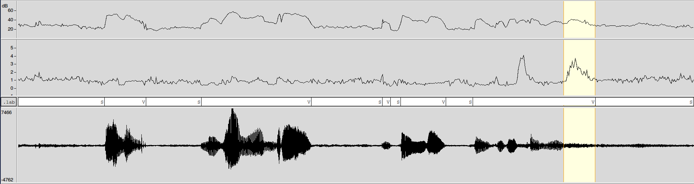
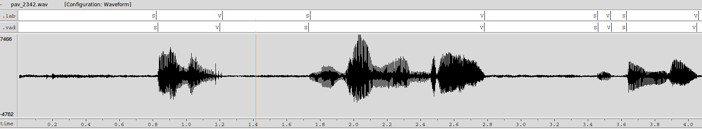
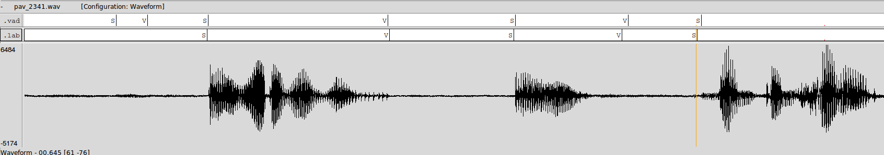
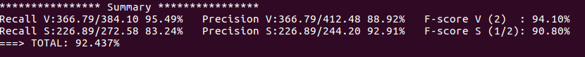
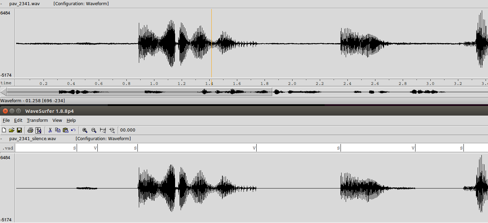
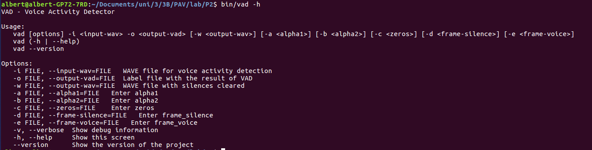

PAV - P2: detección de actividad vocal (VAD)
============================================

# Andrea Iturralde - Albert Gassol


Esta práctica se distribuye a través del repositorio GitHub [Práctica 2](https://github.com/albino-pav/P2),
y una parte de su gestión se realizará mediante esta web de trabajo colaborativo.  Al contrario que Git,
GitHub se gestiona completamente desde un entorno gráfico bastante intuitivo. Además, está razonablemente
documentado, tanto internamente, mediante sus [Guías de GitHub](https://guides.github.com/), como
externamente, mediante infinidad de tutoriales, guías y vídeos disponibles gratuitamente en internet.


Inicialización del repositorio de la práctica.
----------------------------------------------

Para cargar los ficheros en su ordenador personal debe seguir los pasos siguientes:

*	Abra una cuenta GitHub para gestionar esta y el resto de prácticas del curso.
*	Cree un repositorio GitHub con el contenido inicial de la práctica (sólo debe hacerlo uno de los
	integrantes del grupo de laboratorio, cuya página GitHub actuará de repositorio central):
	-	Acceda la página de la [Práctica 3](https://github.com/albino-pav/P2).
	-	En la parte superior derecha encontrará el botón **`Fork`**. Apriételo y, después de unos segundos,
		se creará en su cuenta GitHub un proyecto con el mismo nombre (**P2**). Si ya tuviera uno con ese 
		nombre, se utilizará el nombre **P2-1**, y así sucesivamente.
*	Habilite al resto de miembros del grupo como *colaboradores* del proyecto; de este modo, podrán
	subir sus modificaciones al repositorio central:
	-	En la página principal del repositorio, en la pestaña **:gear:`Settings`**, escoja la opción 
		**Collaborators** y añada a su compañero de prácticas.
	-	Éste recibirá un email solicitándole confirmación. Una vez confirmado, tanto él como el
		propietario podrán gestionar el repositorio, por ejemplo: crear ramas en él o subir las
		modificaciones de su directorio local de trabajo al repositorio GitHub.
*	En la página principal del repositorio, localice el botón **Branch: master** y úselo para crear
	una rama nueva con los primeros apellidos de los integrantes del equipo de prácticas separados por
	guion (**fulano-mengano**).
*	Todos los miembros del grupo deben realizar su copia local en su ordenador personal.
	-	Copie la dirección de su copia del repositorio apretando en el botón **Clone or download**.
		Asegúrese de usar *Clone with HTTPS*.
	-	Abra una sesión de Bash en su ordenador personal y vaya al directorio **PAV**. Desde ahí, ejecute:

		```.sh
		git clone dirección-del-fork-de-la-práctica
		```

	-	Vaya al directorio de la práctica `cd P2`.
	-	Cambie a la rama **fulano-mengano** con la orden:

		```.sh
		git checkout fulano-mengano
		```

*	A partir de este momento, todos los miembros del grupo de prácticas pueden trabajar en su directorio
	local del modo habitual.
	-	También puede utilizar el repositorio remoto como repositorio central para el trabajo colaborativo
		de los distintos miembros del grupo de prácticas; o puede serle útil usarlo como copia de seguridad.
	-	Cada vez que quiera subir sus cambios locales al repositorio GitHub deberá confirmar los
		cambios en su directorio local:

		```.sh
		git add .
		git commit -m "Mensaje del commit"
		```

		y, a continuación, subirlos con la orden:

		```.sh
		git push -u origin fulano-mengano
		```

*	Al final de la práctica, la rama **fulano-mengano** del repositorio GitHub servirá para remitir la
	práctica para su evaluación utilizando el mecanismo *pull request*.
	-	Vaya a la página principal de la copia del repositorio y asegúrese de estar en la rama
		**fulano-mengano**.
	-	Pulse en el botón **New pull request**, y siga las instrucciones de GitHub.


Entrega de la práctica.
-----------------------

Responda, en este mismo documento (README.md), los ejercicios indicados a continuación. Este documento es
un fichero de texto escrito con un formato denominado _**markdown**_. La principal característica de este
formato es que, manteniendo la legibilidad cuando se visualiza con herramientas en modo texto (`more`,
`less`, editores varios, ...), permite amplias posibilidades de visualización con formato en una amplia
gama de aplicaciones; muy notablemente, **GitHub**, **Doxygen** y **Facebook** (ciertamente, :eyes:).

En GitHub. cuando existe un fichero denominado README.md en el directorio raíz de un repositorio, se
interpreta y muestra al entrar en el repositorio.

Debe redactar las respuestas a los ejercicios usando Markdown. Puede encontrar información acerca de su
sintáxis en la página web [Sintaxis de Markdown](https://daringfireball.net/projects/markdown/syntax).
También puede consultar el documento adjunto [MARKDOWN.md](MARKDOWN.md), en el que se enumeran los elementos
más relevantes para completar la redacción de esta práctica.

Recuerde realizar el *pull request* una vez completada la práctica.

Ejercicios
----------

### Etiquetado manual de los segmentos de voz y silencio

- Etiquete manualmente los segmentos de voz y silencio del fichero grabado al efecto. Inserte, a 
  continuación, una captura de `wavesurfer` en la que se vea con claridad la señal temporal, el contorno de
  potencia y la tasa de cruces por cero, junto con el etiquetado manual de los segmentos.

<p align="center">
  
</p>

En la imagen podemos ver la potencia en la primera grática, los cruces por cero en la segunda y la señal de voz en la tercera. La parte seleccionada es la letra `s` y, como podemos observar, la potencia no es muy alta pero los cruces por cero sí. 

Hemos etiquetado los tramos de voz y de silencio de manera que, si entre dos palabras hay un silencio casi indetectable, consideramos ambas como el mismo tramo de voz.

- A la vista de la gráfica, indique qué valores considera adecuados para las magnitudes siguientes:

	* Incremento del nivel potencia en dB, respecto al nivel correspondiente al silencio inicial, para estar
    seguros de que un segmento de señal se corresponde con voz.

    Hemos considerado que el mínimo incremento de potencia para pasar de considerar silencio a voz son 7dB.

	* Duración mínima razonable de los segmentos de voz y silencio.

    Hemos establecido una duración mínima de los segmentos de silencio de 252ms y una duración mínima de los segmentos de voz de 394ms. Como se ha explicado anteriormente, se han evitado considerar como silencios los tramos entre palabras muy juntas o encadenadas.

	* ¿Es capaz de sacar alguna conclusión a partir de la evolución de la tasa de cruces por cero?

    En las consonantes fricativas, hemos conseguido diferenciar que se trataba de voz y no de silencio a base de evaluar los cruces por cero de dichos sonidos. Hemos podido apreciar que el número de crices por cero es aproximadamente el doble al del estado de silencio inicial. 
    
    Cruces por cero letra `s` = 2270
    Cruces por cero estado inicial = 1024

### Desarrollo del detector de actividad vocal

- Complete el código de los ficheros de la práctica para implementar un detector de actividad vocal tan
  exacto como sea posible. Tome como objetivo la maximización de la puntuación-F `TOTAL`.

Fichero `vad.c`

```c
#include <math.h>
#include <stdlib.h>
#include <stdio.h>

#include "vad.h"


float alpha1 = 3;
float alpha2 = 1;
int frames_silence = 3; 
int frames_voice = 7;
int n_init;
const float FRAME_TIME = 10.0F; /* in ms. */

/* 
 * As the output state is only ST_VOICE, ST_SILENCE, or ST_UNDEF,
 * only this labels are needed. You need to add all labels, in case
 * you want to print the internal state in string format
 */

const char *state_str[] = {
  "UNDEF", "S", "V", "INIT"
};

const char *state2str(VAD_STATE st) {
  return state_str[st];
}

/* Define a datatype with interesting features */
typedef struct {
  float zcr;
  float p;
  float am;
} Features;

/* 
 * TODO: Delete and use your own features!
 */

Features compute_features(const float *x, int N, float fm) {
  /*
   * Input: x[i] : i=0 .... N-1 
   * Ouput: computed features
   */
  /* 
   * DELETE and include a call to your own functions
   *
   * For the moment, compute random value between 0 and 1 
   */
  Features feat;
  feat.p = compute_power(x, N);
  feat.am = compute_am(x, N);
  feat.zcr = compute_zcr(x, N, fm);
  return feat;
}

VAD_STATE vad_close(VAD_DATA *vad_data) {
  /* 
   * TODO: decide what to do with the last undecided frames
   */
  VAD_STATE state = vad_data->state;

  free(vad_data);
  return state;
}

unsigned int vad_frame_size(VAD_DATA *vad_data) {
  return vad_data->frame_length;
}

/* 
 * TODO: Implement the Voice Activity Detection 
 * using a Finite State Automata
 */

VAD_STATE vad(VAD_DATA *vad_data, float *x) {

  /* 
   * TODO: You can change this, using your own features,
   * program finite state automaton, define conditions, etc.
   */

  Features f = compute_features(x, vad_data->frame_length, vad_data->sampling_rate);
  vad_data->last_feature = f.p; /* save feature, in case you want to show */

  switch (vad_data->state) {

  case ST_INIT:
    
    if (n_init < 10){
        
        k0 += pow(10, f.p/10);
        n_init ++;
        
        if(n_init == 10){

          k0 = 10*log10(k0/n_init);
          vad_data->state = ST_SILENCE;
          vad_data->k1 = k0 + alpha1;
          vad_data->k2 = vad_data->k1 + alpha2;
        }
    }

    break;

  case ST_SILENCE:

    if (f.p > vad_data->k1)
      vad_data->state = ST_MAY_VOICE;

    break;

  case ST_VOICE:

    if (f.p < vad_data->k2)
      vad_data->state = ST_MAY_SILENCE;

    break;

  case ST_MAY_SILENCE:
      /*
      if(f.p < k0 + threshold){
        if(count_silence < 4){
          count_silence += 1;
        }else{
          vad_data->state = ST_SILENCE;
          count_silence = 0;
        }  
      
      }else{
          count_silence = 0;
          vad_data->state = ST_VOICE;
      }
      */

      if(f.p > vad_data->k1 || f.zcr > vad_data->zeros){
        
        vad_data->state = ST_VOICE;
        vad_data->count_silence = 0;
      
      } else {
          
        vad_data->count_silence++;
        if(vad_data->count_silence == frames_silence){

          vad_data->state = ST_SILENCE;
          vad_data->count_silence = 0;
        }
      }
    break;

  case ST_MAY_VOICE:
  /*
    if(f.p > k0 + threshold){
        if(count_voice < 4){
          count_voice += 1;
        }else{
          vad_data->state = ST_VOICE;
          count_voice = 0;
        }  
      
      }else{
          count_voice = 0;
          vad_data->state = ST_SILENCE;
      }
      */

     if(f.p < vad_data->k2 && f.zcr < vad_data->zeros){
        
        vad_data->state = ST_SILENCE;
        vad_data->count_voice = 0;

      } else {
          
          vad_data->count_voice++;
          
          if(vad_data->count_voice == frames_voice){
            vad_data->count_voice = 0;
            vad_data->state = ST_VOICE;
          }
      }

    break;

  case ST_UNDEF:

    break;

  }

  if (vad_data->state == ST_SILENCE ||
      vad_data->state == ST_VOICE ||
      vad_data->state == ST_MAY_SILENCE ||
      vad_data->state == ST_MAY_VOICE)
    return vad_data->state;
  else
    return ST_UNDEF;
}

void vad_show_state(const VAD_DATA *vad_data, FILE *out) {
  fprintf(out, "%d\t%f\n", vad_data->state, vad_data->last_feature);
}

```

Fichero `main_vad.c`

```c
codiguito
```

- Inserte una gráfica en la que se vea con claridad la señal temporal, el etiquetado manual y la detección
  automática conseguida para el fichero grabado al efecto. 




- Explique, si existen, las discrepancias entre el etiquetado manual y la detección automática.

Conideramos que la discrepancia es mínima pero, aún así, a veces falla a la hora de reconocer tramos de silencio debido a los alto cruces por cero o a la alta potencia. 

- Evalúe los resultados sobre la base de datos `db.v4` con el script `vad_evaluation.pl` e inserte a 
  continuación las tasas de sensibilidad (*recall*) y precisión para el conjunto de la base de datos (sólo
  el resumen).


    
Consideramos que es un muy buen resultado, sobre todo en las tramas de voz.

### Trabajos de ampliación

#### Cancelación del ruido en los segmentos de silencio

- Si ha desarrollado el algoritmo para la cancelación de los segmentos de silencio, inserte una gráfica en
  la que se vea con claridad la señal antes y después de la cancelación (puede que `wavesurfer` no sea la
  mejor opción para esto, ya que no es capaz de visualizar varias señales al mismo tiempo).



#### Gestión de las opciones del programa usando `docopt_c`

- Si ha usado `docopt_c` para realizar la gestión de las opciones y argumentos del programa `vad`, inserte
  una captura de pantalla en la que se vea el mensaje de ayuda del programa.



### Contribuciones adicionales y/o comentarios acerca de la práctica

- Indique a continuación si ha realizado algún tipo de aportación suplementaria (algoritmos de detección o 
  parámetros alternativos, etc.).

Hemos generado un script con distintos valores para las variables `alpha1`, `alpha2`,`zeros` `frames_silence` y `frames_voice`, de manera que para cada fichero de audio, itera dichos valores x veces entre x valores para encontrar la combinación que resulte en una F-score mayor. Lo hemos comprobado en la base de datos dada para la práctia y el valor msálto obtenido ha sido 93,146.

También, hemos decidido añadir el extra de poner a valor `0` los tramos de silencio de las grabaciones de la base de datos. 

De ambas aportaciones suplementarias se ha subido el código a GitHub.

- Si lo desea, puede realizar también algún comentario acerca de la realización de la práctica que considere
  de interés de cara a su evaluación.

Nos ha parecido muy interesante esta práctica, pero consideramos que el hecho de que no solo "hagamos la práctica en sí", si nó que también aprendamos a utilizar git y refrequemos conocimientos de la programación en C, la hace más larga de lo que debería, y es inasumible en dos sesiones de laboratorio.  

### Antes de entregar la práctica

Recuerde comprobar que el repositorio cuenta con los códigos correctos y en condiciones de ser 
correctamente compilados con la orden `meson bin; ninja -C bin`. El programa generado (`bin/vad`) será
el usado, sin más opciones, para realizar la evaluación *ciega* del sistema.
